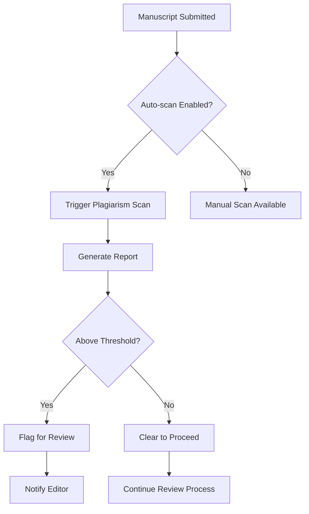

# Plagiarism Checker Bot

The Plagiarism Checker Bot helps maintain academic integrity by scanning manuscripts for potential plagiarism against multiple academic databases and sources.

## Overview

This bot provides automated plagiarism detection to support the peer review process. It can be triggered manually by editors or configured to run automatically when manuscripts are submitted.

**Bot ID**: `plagiarism-checker`  
**Version**: `1.0.0`  
**Author**: Colloquium Team  
**Status**: Seeded (available but not yet implemented)

## Planned Actions

### 1. Scan Manuscript (`scan_manuscript`)

Performs comprehensive plagiarism check against configured databases.

#### Input Parameters

```json
{
  "manuscriptId": "string (required)",
  "databases": "array (optional, defaults to configured databases)",
  "threshold": "number (optional, 0-1, defaults to configured threshold)",
  "excludeReferences": "boolean (optional, defaults to true)"
}
```

#### Example Usage

**Via Conversation:**
```
@Plagiarism Checker scan manuscript ms-123 for potential plagiarism
```

**Via API:**
```bash
curl -X POST http://localhost:4000/api/bots/plagiarism-checker/execute/scan_manuscript \
  -H "Content-Type: application/json" \
  -H "Cookie: auth-token=your-jwt-token" \
  -d '{
    "input": {
      "manuscriptId": "cm287example123",
      "threshold": 0.15,
      "excludeReferences": true
    }
  }'
```

#### Expected Response

```json
{
  "message": "Plagiarism scan completed",
  "result": {
    "scanId": "scan-12345",
    "manuscriptId": "cm287example123",
    "overallSimilarity": 0.08,
    "status": "CLEAR",
    "matches": [
      {
        "source": "doi:10.1234/example",
        "similarity": 0.05,
        "text": "Common methodological description",
        "location": "Methods section, paragraph 2"
      }
    ],
    "databases": ["crossref", "pubmed", "arxiv"],
    "excludedReferences": true,
    "scanDate": "2024-01-15T14:30:00.000Z"
  },
  "botMessage": "Plagiarism scan completed. Overall similarity: 8% (below threshold). No significant matches found."
}
```

### 2. Generate Report (`generate_report`)

Creates detailed plagiarism report with highlighted sections.

#### Input Parameters

```json
{
  "scanId": "string (required)",
  "format": "string (optional, 'PDF' or 'HTML', defaults to 'PDF')"
}
```

### 3. Recheck Section (`recheck_section`)

Re-scans specific sections that may have been flagged.

#### Input Parameters

```json
{
  "manuscriptId": "string (required)",
  "section": "string (required, e.g., 'abstract', 'introduction', 'methods')",
  "threshold": "number (optional)"
}
```

## Configuration Schema

The Plagiarism Checker supports the following configuration:

```json
{
  "type": "object",
  "properties": {
    "databases": {
      "type": "array",
      "items": { "type": "string" },
      "description": "Databases to search against",
      "default": ["crossref", "pubmed", "arxiv"]
    },
    "threshold": {
      "type": "number",
      "minimum": 0,
      "maximum": 1,
      "description": "Similarity threshold for flagging (0-1)",
      "default": 0.15
    },
    "excludeReferences": {
      "type": "boolean", 
      "description": "Exclude reference sections from scanning",
      "default": true
    },
    "autoTrigger": {
      "type": "boolean",
      "description": "Automatically scan new submissions",
      "default": false
    },
    "triggerOnSubmission": {
      "type": "boolean",
      "description": "Scan when manuscript is first submitted",
      "default": true
    }
  }
}
```

### Default Configuration

```json
{
  "databases": ["crossref", "pubmed", "arxiv"],
  "threshold": 0.15,
  "excludeReferences": true,
  "autoTrigger": false,
  "triggerOnSubmission": true
}
```

## Supported Databases

| Database | Description | Coverage |
|----------|-------------|----------|
| **CrossRef** | Academic publications database | 130M+ scholarly works |
| **PubMed** | Biomedical literature database | 35M+ citations |
| **arXiv** | Pre-print repository | 2M+ papers |
| **Google Scholar** | Broad academic search | Comprehensive coverage |
| **Internal** | Previously submitted manuscripts | Journal-specific |

## Permissions

The Plagiarism Checker requires:

| Permission | Description |
|------------|-------------|
| `manuscript.read` | Access manuscript content for scanning |
| `manuscript.attach_report` | Attach plagiarism reports to manuscripts |

## User Access Control

### Who Can Execute Actions

| Role | Scan Manuscript | Generate Report | Recheck Section |
|------|----------------|-----------------|-----------------|
| **Admin** | ✅ | ✅ | ✅ |
| **Editor** | ✅ | ✅ | ✅ |
| **Action Editor** | ✅ | ✅ | ✅ |
| **Reviewer** | ❌ | ❌ | ❌ |
| **Author** | ❌ | ❌ | ❌ |

## Scan Results & Interpretation

### Similarity Levels

- **0-10%**: Acceptable similarity (common phrases, methodologies)
- **10-20%**: Low concern (review flagged sections)
- **20-40%**: Moderate concern (requires editorial review)
- **40%+**: High concern (potential plagiarism)

### Status Classifications

- **`CLEAR`**: Below threshold, no significant matches
- **`REVIEW`**: Above threshold, requires human review
- **`FLAGGED`**: High similarity, potential plagiarism detected
- **`ERROR`**: Scan failed or incomplete

### Report Sections

1. **Executive Summary**: Overall similarity percentage and status
2. **Database Matches**: Specific sources with similarity scores
3. **Highlighted Text**: Sections with potential matches
4. **Excluded Content**: References and citations not scanned
5. **Recommendations**: Actions for editors/reviewers

## Installation & Setup

### Current Status

The Plagiarism Checker is **seeded** in the database but not yet fully implemented. It appears in the bot registry with:

```json
{
  "id": "plagiarism-checker",
  "name": "Plagiarism Checker", 
  "isInstalled": true,
  "isEnabled": true,
  "actions": 0,
  "permissions": 0
}
```

### Implementation Steps

To complete the implementation:

1. **Create Action Classes**: Implement `ScanManuscriptAction`, `GenerateReportAction`, etc.
2. **Add to Registry**: Update bot definition with actual actions
3. **Database Integration**: Connect to plagiarism detection APIs
4. **Report Generation**: Implement PDF/HTML report creation
5. **UI Integration**: Add scan results display to manuscript pages

### API Integration

The bot will integrate with external plagiarism detection services:

```typescript
// Example service integration
class PlagiarismService {
  async scanText(text: string, options: ScanOptions): Promise<ScanResult> {
    // Integration with Turnitin, iThenticate, or similar
  }
  
  async checkAgainstDatabase(text: string, database: string): Promise<Match[]> {
    // Database-specific checking
  }
}
```

## Usage Examples

### Manual Scan

```bash
# Scan specific manuscript
curl -X POST http://localhost:4000/api/bots/plagiarism-checker/execute/scan_manuscript \
  -H "Content-Type: application/json" \
  -H "Cookie: auth-token=editor-token" \
  -d '{
    "input": {
      "manuscriptId": "ms-123",
      "threshold": 0.1,
      "databases": ["crossref", "pubmed"]
    }
  }'
```

### Automatic Triggering

```json
{
  "config": {
    "autoTrigger": true,
    "triggerOnSubmission": true,
    "threshold": 0.12
  }
}
```

### Integration with Review Process

```typescript
// Example workflow integration
async function onManuscriptSubmitted(manuscriptId: string) {
  if (plagiarismBot.config.triggerOnSubmission) {
    await BotRegistry.executeAction(
      'plagiarism-checker',
      'scan_manuscript',
      { manuscriptId },
      { userId: 'system' }
    );
  }
}
```

## Future Enhancements

### Planned Features

1. **Real-time Scanning**: Live detection during manuscript editing
2. **AI-Powered Analysis**: Machine learning for better false positive detection
3. **Collaboration Detection**: Identify potential unauthorized collaboration
4. **Version Comparison**: Track changes across manuscript revisions
5. **Author Training**: Educational feedback for authors

### Advanced Configuration

```json
{
  "advancedOptions": {
    "ignoreQuotations": true,
    "minimumMatchLength": 50,
    "fuzzyMatching": true,
    "languageDetection": true,
    "disciplineSpecific": "computer-science"
  }
}
```

### Reporting Enhancements

- **Interactive Reports**: Clickable matches with source links
- **Batch Reporting**: Scan multiple manuscripts simultaneously
- **Trend Analysis**: Institution-wide plagiarism statistics
- **Export Options**: Integration with external reporting tools

## Error Handling

### Common Issues

| Error | Cause | Solution |
|-------|-------|----------|
| `Database timeout` | Slow API response | Retry with smaller text chunks |
| `Quota exceeded` | API rate limits | Configure scanning schedule |
| `Unsupported format` | Invalid manuscript format | Convert to supported format |
| `Network error` | Connection issues | Check API credentials and connectivity |

### Troubleshooting

```bash
# Check bot status
curl http://localhost:4000/api/bots/plagiarism-checker

# View execution history
curl http://localhost:4000/api/bots/plagiarism-checker/executions

# Test configuration
curl -X PUT http://localhost:4000/api/bots/plagiarism-checker/configure \
  -d '{"config": {"threshold": 0.2}, "isEnabled": true}'
```

## Compliance & Privacy

### Data Handling

- **Temporary Storage**: Manuscript text cached only during scanning
- **Anonymization**: Personal information stripped before external API calls
- **Retention Policy**: Scan results retained per journal policy
- **Access Control**: Results visible only to authorized users

### Academic Integrity

- **Educational Use**: Results support learning and improvement
- **Due Process**: Authors informed of scan results and given opportunity to respond
- **Appeal Process**: Mechanism for challenging false positives
- **Transparency**: Clear policies on plagiarism detection and consequences

## Integration Points

### Manuscript Workflow



### Notification System

When integrated with notifications:
- **Scan Complete**: Notify requesting editor
- **High Similarity**: Alert editorial team
- **Report Ready**: Email report to stakeholders
- **Author Notification**: Inform authors if required